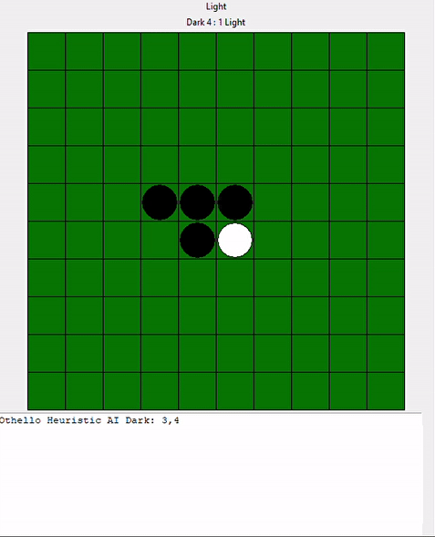
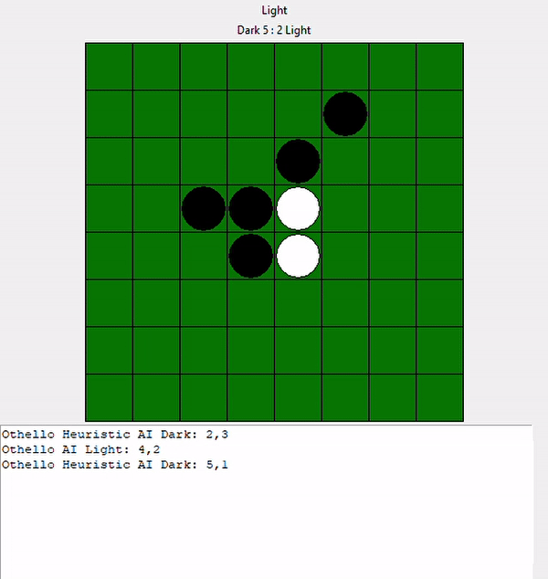

# Othelo.Ai
This Ai uses alpha beta prunning and smart heuristics to beat other agents in the game of Othelo.

## Results
The following is the result of our smart heuristic agent using alpha beta prunning against random and basic heuristic agents:

Again Random Agent (white) | Against an Ai Agent (white)
:------------:|:--------------------:
)|

## Running
To play against my Ai, run:
```bash
    python othello_gui.py -d 8 -a agent_smarter.py -l 6 -o 
```

